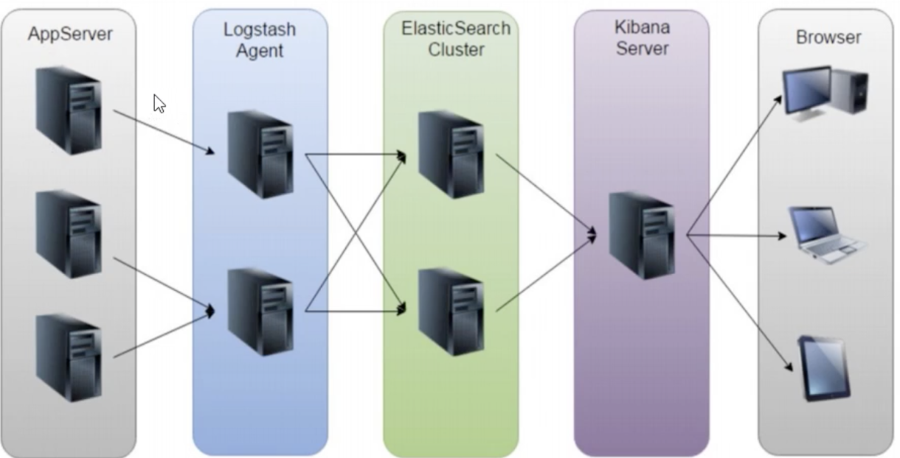
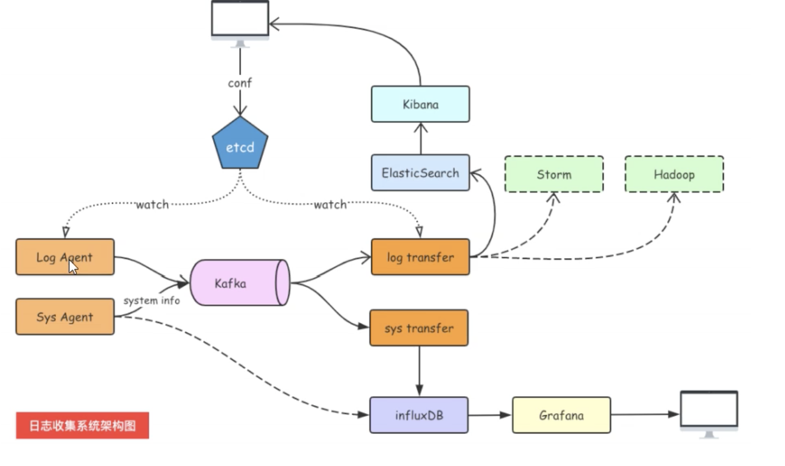

## 日志收集项目架构设计及kafka介绍

### ELK 项目架构

### ELK方案的问题

- 运维成本高，每增加一个日志收集项，都需要手动修改配置
- 监控缺失，无法准确获取logstash的状态
- 无法做到定制化开发和维护

### 架构设计

### Kafka 原理:

Kafka选择分区模式(3种)：

- 指定往哪个分区写
- 指定key,kafka根据key做hash然后决定写哪个分区
- 轮询方式

生产者往kafka发送数据的模式(3种):

- `0 :` 把数据发送给Leader就成功，效率高，安全性最低
- `1 :`把数据发送给leader,等待leaader确认回ACK
- `all :`把数据发送给leader，确保follow从leader拉取数据回复ACK给leader,leader在回复ACK，安全性最高

